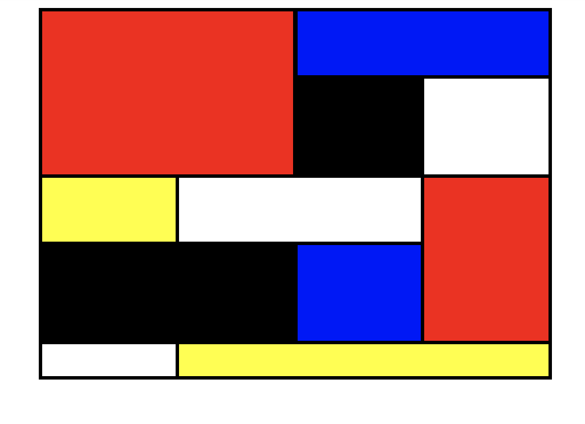
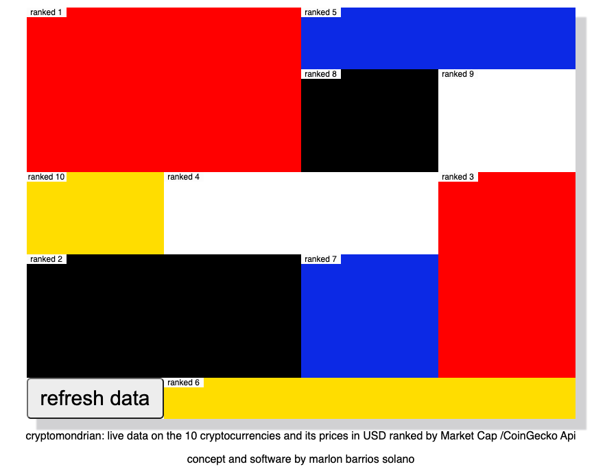
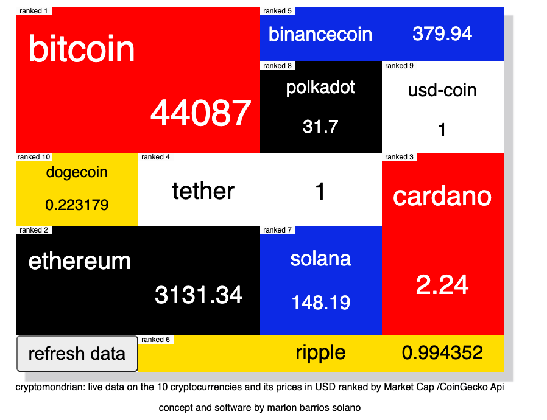
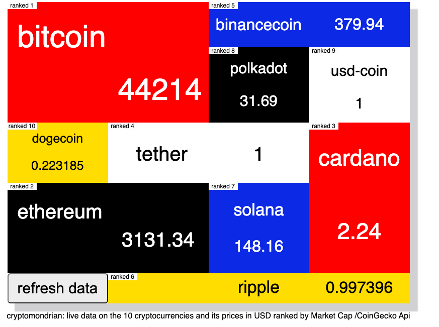

# Project1_app_with-API-cryptomondrian

# CryptoMondrian

CryptoMondrian is a desktop App that displays the top 10 cryptocurrencies names and prices in dollars using a CSS grid system inspired by the work of [Piet Mondrian](https://en.wikipedia.org/wiki/Piet_Mondrian).
The name and the price are placed in descendent order from the largest to the smaller blocks. Clors are and block sizes aee static.
The data is fetched using the [CoinGecko API](https://duckduckgo.com).
User can click button and refresh data or wait until the data is refreshes every 60 seconds.
Image of de model and the CSS grid with no data:

.

## Technologies used:
- HTML
- CSS
- JavaScript
- JQuery

## Images before and after refreshing:

-----

## Getting Started:
[The app is lives here:](https://crypto-mondrian.netlify.app/?).

Click the refresh data button to get new data.

## Future Enhancements:
- Mobile responsive design.
- The boxes will dynamically chage of size based on the market capital and.or price.
- The user can click in the name of the cryptocurrency and will go to a search using the cryptocurrency name for the search.
- Reorganized as a table or list.
- Upload screenshot to an NFT market.

